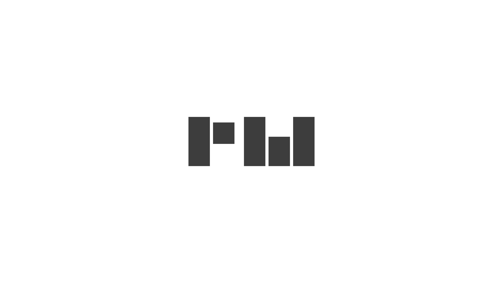

    <h1>
        Randy Assani Beni  
    </h1>

    

<h2 align="left"> 
    Hi ! 
     
    Welcome to my GitHub profile
</h2>

---

<h2>📖 About me</h2>
    
- 😄 I'm Software Engineer with a Computer Science degree and experience on computer engineering,   software development, UX/UI design & teaching 
- 🎨 I design and develop all types of applications (web, mobile and desktop)
- 🕒 Time Management and Agile Project Management(scrum & Kanban)
- 🎓 Graduated in Computer Engineering at the University of Kinshasa (UNIKIN 2015)
- 🌐 <strong>Visit My Portfolio : <a href="https://randyassani.dev" target="_blank">randyassani.dev</a></strong>

---

    <h2>🔥 My contribution sequence</h2>
    

      
    

---

<h2>🤝 Connect with me</h2>

    

---

<h2>🧠 Tech stack</h2>

- 💻 &nbsp; Language : JavaScript | PHP | TypeScript
- 👨‍💻 &nbsp; Backend : Node Js | Express Js | Nest Js | PHP | Laravel | Symfony 
- 🌐 &nbsp; Frontend : HTML | CSS | JavaScript | React Js | React Native | Next Js | Gatsby Js | Jquery | SCSS
- 🛢 &nbsp; Database : MySQL | MongoDB | Postgresql
- 🔧&nbsp; Tools : Git | GitHub | Linux | windows
   
  

   

---

<h2>🔆 Github stats</h2>
<!-- https://github.com/anuraghazra/github-readme-stats -->

<h3>🚀 GitHub profile stats</h3>
 

<h3>⚡ Most used languages</h3>
 

 

 

 

 
<b>notice :</b> This graph is only a measure of the languages that make up my public   code on GitHub and does not reflect my experience or skill level.
 

<!--

 
  
⚡ Most used languages

   
    
   
  <b>notice :</b> This graph is only a measure of the languages that make up my public code on GitHub and does not reflect my experience or skill level.

-->

<!--
**Randy-RM/Randy-RM** is a ✨ _special_ ✨ repository because its `README.md` (this file) appears on your GitHub profile.

Here are some ideas to get you started:

- 🔭 I’m currently working on ...
- 🌱 I’m currently learning ...
- 👯 I’m looking to collaborate on ...
- 🤔 I’m looking for help with ...
- 💬 Ask me about ...
- 📫 How to reach me: ...
- 😄 Pronouns: ...
- ⚡ Fun fact: ...
-->
