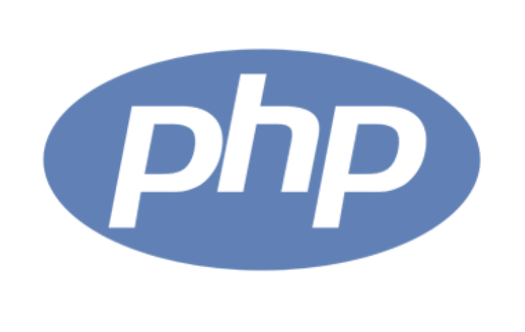

<h3 align="center"> Randy Assani Beni Muhema<a href="https://portfolio-assani-beni-randy.netlify.app/"> AKA </a> - Randy-RM  </h3>

  

## 📖 About me

- 💻 I'm a Design Analyst, FullStack Developer & Graphic Designer 
- 🎨 I design and develop all types of applications (web, mobile and desktop)
- 📱 Time Management and Agile Project Management(scrum && Kanban)
- 🎓 Graduated in Computer Engineering at the University of Kinshasa (UNIKIN 2015)
- 🌐 <a href="https://portfolio-assani-beni-randy.netlify.app/">My portfolio </a>

## 👨‍💻 Technical Skills:

<table>
    <tbody>
        <tr>
            <td>
              
            </td>
            <td>
              
            </td>
            <td>
              
            </td>
            <td>
              
            </td>
            <td>
              
            </td>
            <td>
              
            </td>
            <td>
              
            </td>
        </tr>
    </tbody>
</table>

## 📈 Github Stats

<!-- https://github.com/anuraghazra/github-readme-stats -->

  
📊 GitHub Profile Stats

   
  

<!--
**Randy-RM/Randy-RM** is a ✨ _special_ ✨ repository because its `README.md` (this file) appears on your GitHub profile.

Here are some ideas to get you started:

- 🔭 I’m currently working on ...
- 🌱 I’m currently learning ...
- 👯 I’m looking to collaborate on ...
- 🤔 I’m looking for help with ...
- 💬 Ask me about ...
- 📫 How to reach me: ...
- 😄 Pronouns: ...
- ⚡ Fun fact: ...
-->
